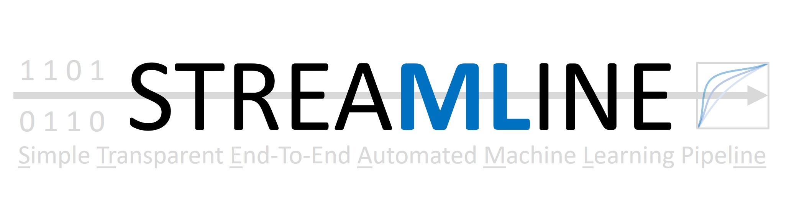

STREAMLINE
======================================

Overview
--------------------------------------
STREAMLINE is an end-to-end automated machine learning (AutoML) pipeline
that empowers anyone to easily run, interpret, and apply a rigorous and
customizable analysis for data mining or predictive modeling.

Notably, this tool is currently limited to supervised learning on tabular,
binary classification data but will be expanded as our development continues.

The development of this pipeline focused on
   1. overall automation
   2. avoiding and detecting sources of bias,
   3. optimizing modeling performance,
   4. ensuring complete reproducibility (under certain STREAMLINE parameter settings),
   5. capturing complex associations in data (e.g. feature interactions), and
   6. enhancing interpretability of output.

Overall, the goal of this pipeline is to provide a transparent framework to learn from
data as well as identify the strengths and weaknesses of ML modeling algorithms or other AutoML algorithms.

Schematic
--------------------------------------
This schematic breaks the overall pipeline down into 4 basic components: (1) preprocessing and feature transformation, (2) feature importance evaluation and selection, (3) modeling, and (4) postprocessing.

.. image:: pictures/ML_pipe_schematic.png

Preprint
--------------------------------------

A preprint introducing and applying STREAMLINE is now available on `Arxiv
<https://arxiv.org/abs/2206.12002?fbclid=IwAR1toW5AtDJQcna0_9Sj73T9kJvuB-x-swnQETBGQ8lSwBB0z2N1TByEwlw>`_

Disclaimer
--------------------------------------
We make no claim that this is the best or only viable way to assemble an ML analysis pipeline for a given classification
problem, nor that the included ML modeling algorithms will yield the best performance possible.
We intend many expansions/improvements to this pipeline in the future to make it easier to use and
hopefully more effective in application. We welcome feedback, suggestions, and contributions for improvement.

Acknowledgements
--------------------------------------
STREAMLINE is the result of 3 years of on-and-off development gaining feedback from multiple biomedical research collaborators at the University of Pennsylvania,
Fox Chase Cancer Center, Cedars Sinai Medical Center, and the University of Kansas Medical Center.
The bulk of the coding was completed by Ryan Urbanowicz, Robert Zhang and Harsh Bandhey. Special thanks to
Yuhan Cui, Pranshu Suri, Patryk Orzechowski, Trang Le, Sy Hwang, Richard Zhang, Wilson Zhang,
and Pedro Ribeiro for their code contributions and feedback.

We also thank the following collaborators for their feedback on application
of the pipeline during development: Shannon Lynch, Rachael Stolzenberg-Solomon,
Ulysses Magalang, Allan Pack, Brendan Keenan, Danielle Mowery, Jason Moore, and Diego Mazzotti.

.. toctree::
   :maxdepth: 2
   :hidden:
   :caption: Table of Contents:

   self
   about
   sample
   install
   colab
   local
   cluster
   analysis
   phases
   parameters
   tips
   development
   models
   citation
   modules

