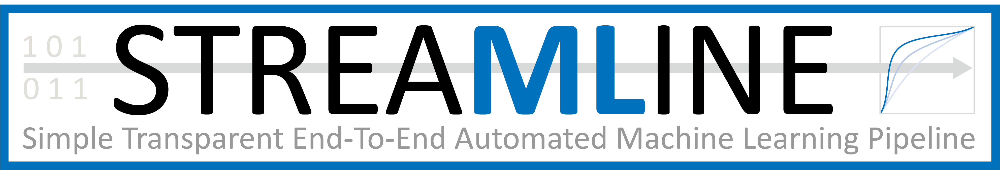
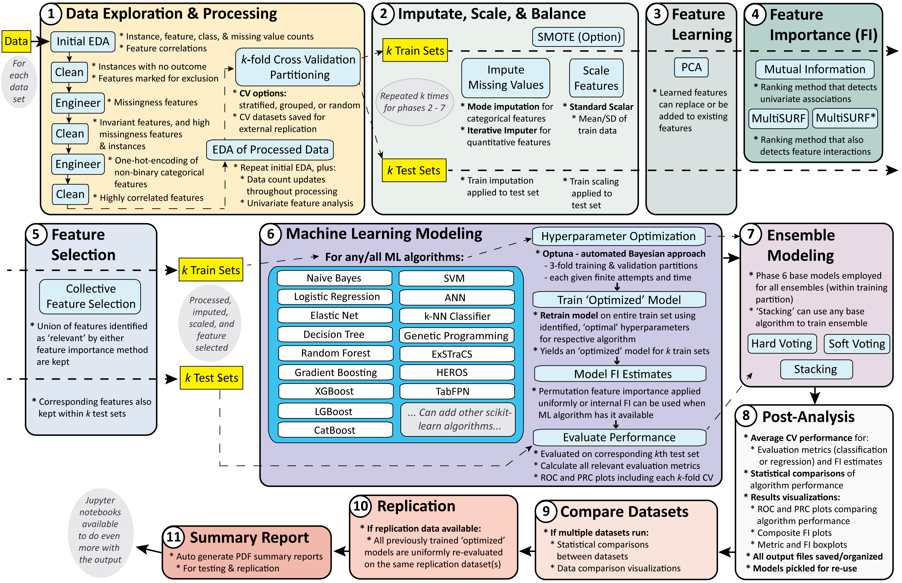

STREAMLINE
======================================

Overview
--------------------------------------

STREAMLINE is an end-to-end automated machine learning pipeline for
supervised tabular data. The current refactored codebase supports binary
classification, multiclass classification, and regression, with integrated
data processing, imputation, scaling, feature learning, feature importance,
feature selection, model training, classification ensembles, summary
statistics, dataset comparison, replication, and PDF reporting.

The schematic below summarizes the current STREAMLINE v3 workflow.

The repository is organized around eleven explicit phases:

.. list-table::
   :header-rows: 1

   * - Phase
     - Name
     - Purpose
   * - P1
     - Data Process
     - Load data, infer or apply feature types, run exploratory summaries, and create CV partitions.
   * - P2
     - Impute and Scale
     - Impute missing values, scale quantitative features, and optionally apply SMOTE/SMOTENC to training folds.
   * - P3
     - Feature Learning
     - Learn transformed features such as PCA components and record feature-learning manifests.
   * - P4
     - Feature Importance
     - Score features with filter-style feature-importance methods.
   * - P5
     - Feature Selection
     - Select reduced feature sets for downstream modeling.
   * - P6
     - Modeling
     - Train and evaluate base models with Optuna accounting and optional native categorical handling.
   * - P7
     - Ensembles
     - Train classification ensembles on top of base model predictions.
   * - P8
     - Summary Statistics
     - Aggregate metrics and summarize model and feature behavior.
   * - P9
     - Compare Datasets
     - Compare results across datasets within an experiment.
   * - P10
     - Replication
     - Apply trained workflows to external replication datasets.
   * - P11
     - Reporting
     - Generate standard and replication PDF reports.

Recommended Starting Points
--------------------------------------

* Use :doc:`install` to prepare a local environment.
* Use :doc:`data` to format custom datasets and understand the included UCI demos.
* Use :doc:`running` for notebooks, config-driven runs, and phase-by-phase CLI commands.
* Use :doc:`parameters` when editing ``.cfg`` files or command-line calls.
* Use :doc:`output` to navigate experiment folders and reports.

Current Scope
--------------------------------------

STREAMLINE is intended for supervised learning on tabular datasets. It does
not automate feature extraction from unstructured data such as free text,
images, audio, video, or raw time-series streams. Regression runs should skip
P7 because the current ensemble registry is classification-only.

Disclaimer
--------------------------------------

STREAMLINE assembles a practical, reproducible machine learning workflow, but
it is not a guarantee that the included preprocessing choices, models, or
metrics are optimal for every scientific question. Users should still review
input data quality, feature definitions, leakage risk, metric choice, and
domain-specific interpretation.

Contact
--------------------------------------

For general questions and collaborations, contact Ryan Urbanowicz at
``ryan.urbanowicz@cshs.org``.

For codebase, installation, running, troubleshooting, and implementation
questions, contact Harsh Bandhey at ``harsh.bandhey@cshs.org``.

.. toctree::
   :maxdepth: 2
   :hidden:
   :caption: Table of Contents:

   self
   about
   pipeline
   data
   install
   running
   parameters
   output
   tips
   more
   development
   contributing
   citation
   modules
